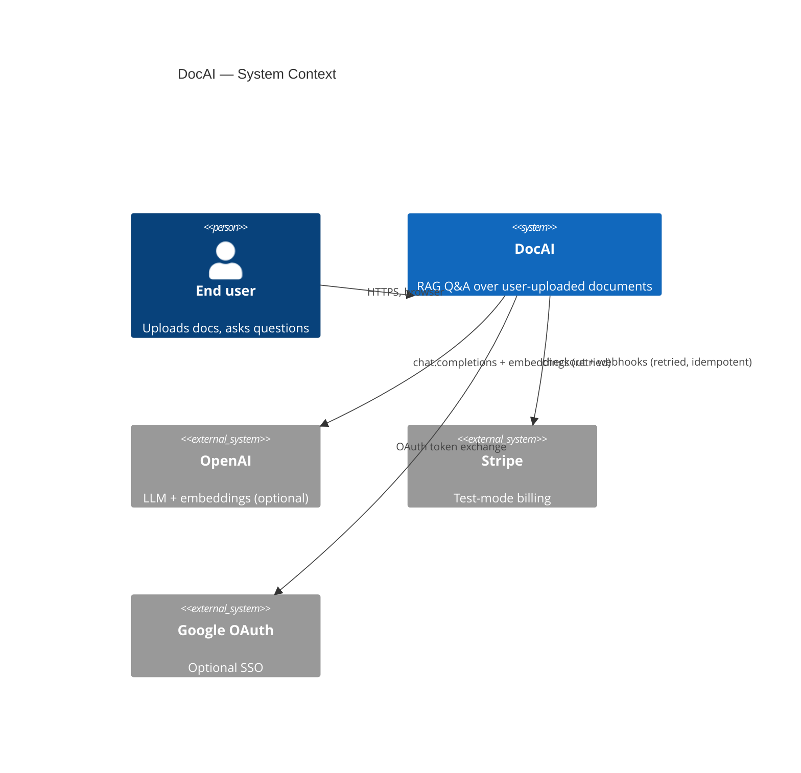
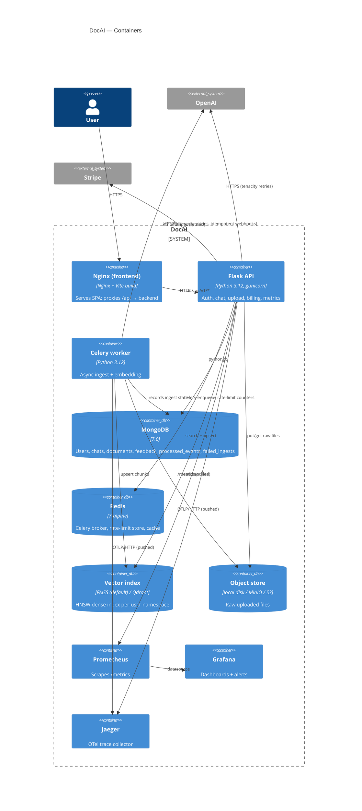
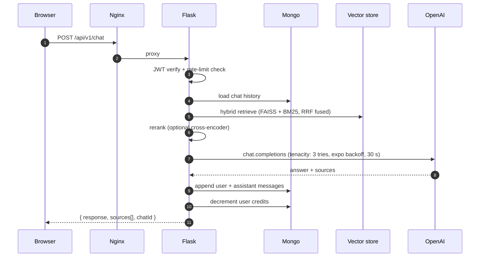
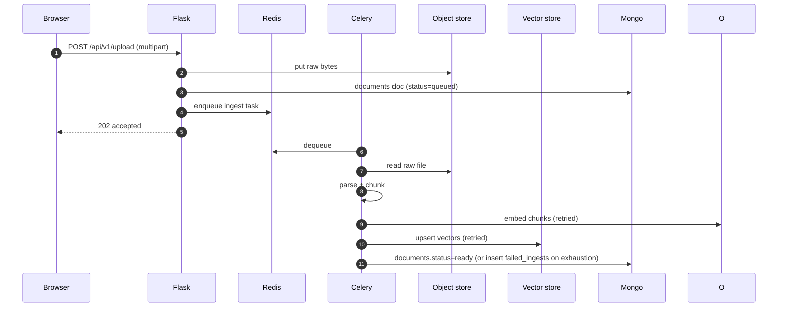
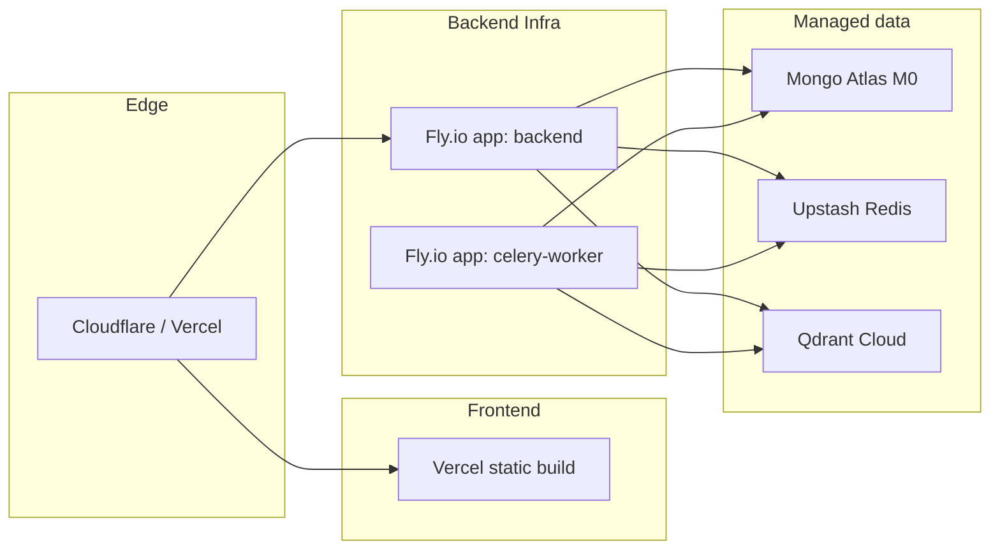

# DocAI — Architecture

This document captures the runtime shape of DocAI as an interview-ready reference. For the design decisions behind each choice see [docs/adr/](docs/adr/).

## System context (C4 L1)

## Container diagram (C4 L2)

## Request path — a chat turn

## Async ingest path

## Data model (selected collections)

| Collection | Key indexes | Purpose |
|---|---|---|
| `users` | `email` unique | Auth + credits |
| `chats` | `userId`, `updatedAt` | Conversation threads |
| `documents` | `userId`, `status` | Per-user upload registry |
| `feedback` | `{chatId,messageTimestamp}` unique | Thumbs up/down per message |
| `processed_events` | `event_id` unique, `receivedAt` TTL 30 d | Stripe webhook idempotency |
| `failed_ingests` | `userId`, `createdAt` | Celery DLQ |

## Boundaries where retries / idempotency live

1. **OpenAI / Stripe / Qdrant / S3** — `with_retry(...)` in [backend/resilience.py](backend/resilience.py).
2. **Stripe webhook** — `processed_events` collection with a unique index on `event_id`; duplicate insert returns 200 without re-crediting.
3. **Celery ingest task** — `autoretry_for=(openai.APIError, ConnectionError)`, `retry_backoff=True`, `acks_late=True`. On exhaustion the job inserts into `failed_ingests` and the worker moves on rather than blocking the queue.
4. **Graceful shutdown** — gunicorn `graceful_timeout=30`; Celery `worker_shutting_down` handler closes Qdrant and flushes OTel spans.

## Deployment topology (intended)

Current deploy is local `docker compose` only; Wave I hosted deploy is tracked in [docs/roadmap.md](docs/roadmap.md).

## See also

- [docs/adr/0001-vector-db.md](docs/adr/0001-vector-db.md) — Qdrant vs Pinecone vs FAISS
- [docs/adr/0002-object-store.md](docs/adr/0002-object-store.md) — MinIO vs direct S3
- [docs/adr/0003-async-framework.md](docs/adr/0003-async-framework.md) — Celery vs RQ vs asyncio
- [docs/adr/0004-web-framework.md](docs/adr/0004-web-framework.md) — Flask vs FastAPI
- [RUNBOOK.md](RUNBOOK.md) — operational playbooks
- [SECURITY.md](SECURITY.md) — threat model + disclosure
